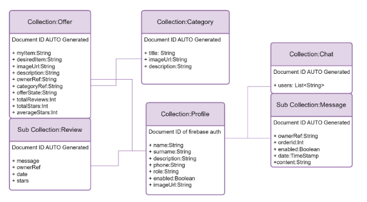
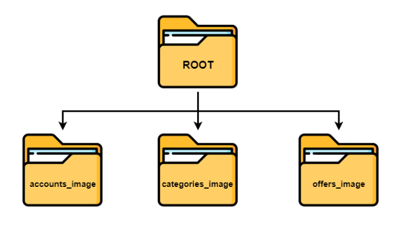
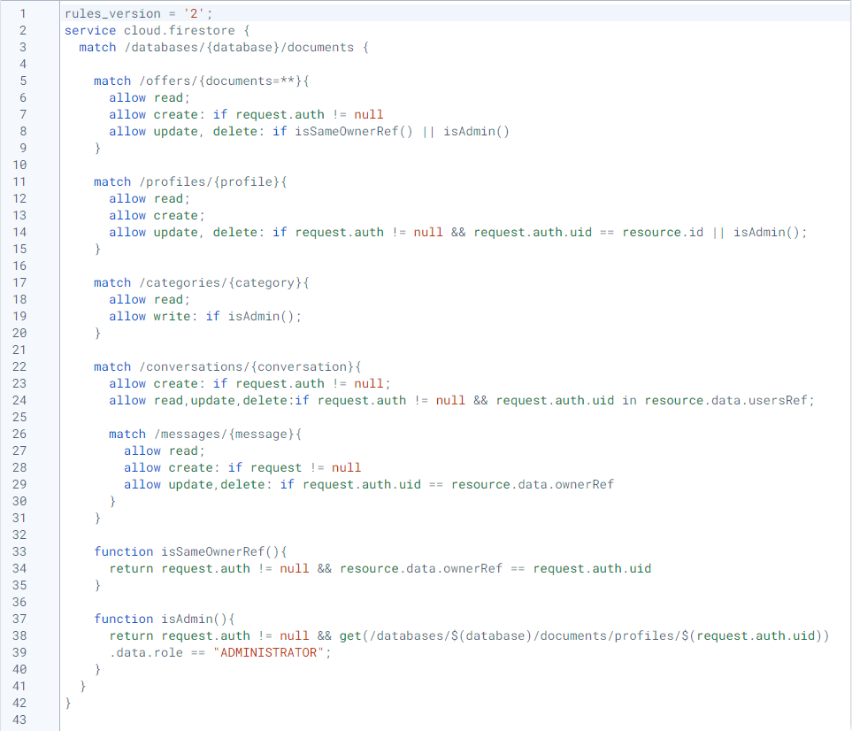
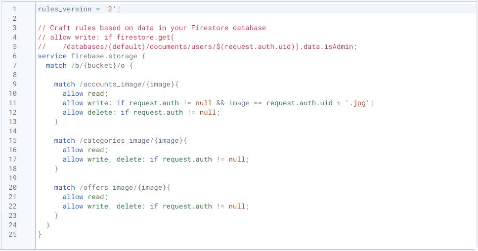
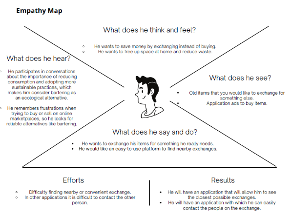
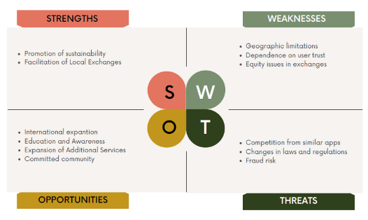
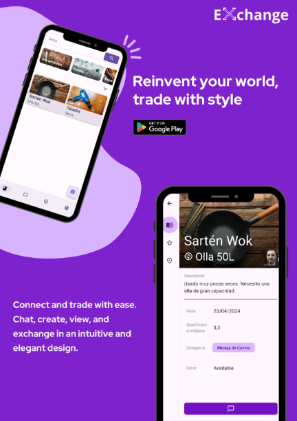
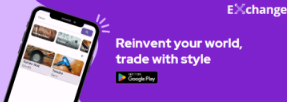

# Table of contents
- [Introduction](#introduction)
  - [App Goals](#app-goals)
- [Target](#target)
- [Technical documentation](#technical-documentation)
  - [Tecnologies](#tecnologies)
  - [Roles functional requirements](#roles-functional-requirements)
  - [NoSQL database design](#nosql-database-design)
  - [Firebase storage structure](#firebase-storage-structure)
  - [Firebase rules](#firebase-rules)

- [Programming](#programming)
  - [Gitlab Original Repository](#gitlab-original-repository)
- [Individual Portfolio of each member of the group](#individual-portfolio-of-each-member-of-the-group)
- [Configure](#configure)
- [FOL](#fol)
  - [Selection of SDGs](#selection-of-sdgs)
  - [Empathy Map](#empathy-map)
  - [SWOT Analysis](#swot-analysis)
  - [Marketing strategy and advertising](#marketing-strategy-and-advertising)
- [Future lines](#future-lines)
- [Conclusion](#conclusion)

  

# Introduction

## App Goals

The application allows users to lend, borrow, or exchange objects 
of different categories among themselves for a defined and specific period of time. 

These are the goals, both application-specific and aligned with the SDGs, 
that we aim to achieve through the application:

### Facilitate Access to Resources:

- Allow users to access tools or items they need but might not be able to 
afford by facilitating trades with items they already own.

- Enable users to publish trade offers, providing access to 
resources they might not otherwise obtain due to financial constraints.

### Promote Sustainable Consumption:

- Encourage responsible consumption by promoting the exchange 
of pre-owned items instead of purchasing new ones.

- Reduce waste by facilitating the reuse of items 
that would otherwise go unused.

### Reduce Inequalities (aligned with SDG 10):

- Mitigate inequalities by providing a platform where users 
can access resources they need through trading, regardless of financial constraints.

- Enable users to exchange items, thereby reducing the disparity 
in access to resources based on economic status.

### Encourage Responsible Consumption and Products (aligned with SDG 12):

- Promote responsible consumption by encouraging users to trade 
items they no longer need instead of discarding them.

- Foster a culture of responsible consumption by providing a 
platform for users to find new homes for their unused items, 
reducing waste and environmental impact.

## Target

Our application is targeted towards individuals interested in sustainable consumption practices, 
reducing inequalities, and promoting responsible consumption. We aim to attract users who need 
access to tools or items but might face financial constraints, as well as those who wish to 
save by avoiding the purchase of items they may only need for a single use.

Additionally, our target audience includes individuals interested in reducing waste and promoting 
the reuse of pre-owned items. We aim to attract users who are conscious of the environmental impact 
of their consumption habits and are willing to participate in a community-driven platform for 
trading and exchanging items, including those who support the United Nations Sustainable 
Development Goals, particularly Goal 10: Reduced Inequalities and Goal 12: Responsible Consumption and Production.

# Technical documentation

## Tecnologies
|Type|Tecnologes|
|--|--|
|FrontEnd||
|Database||
|Lenguage||
|IDE||
|Other tecnologies||

## Roles functional requirements

In our application, there are two user roles: Administrator and User.

### Administrator Role:

Administrators have full control over the platform. They can:

- Manage the creation, modification, and deletion of categories, users, and offers.
- Filter categories, users, and offers.
- Manage conversations with other users, including creating, modifying, and deleting them.
- Create reviews, delete reviews, and censor comments on reviews.
- Block users.

### User Role:

Users have limited control over the platform. They can:

- Manage the creation, modification, and deletion of their own profile and their own offers.
- Manage conversations with other users, including creating, modifying, and deleting them.
- Create reviews.
- Filter offers.

## NoSQL database design

This is our database design

## Firebase storage structure

## Firebase rules

- Firebase firestore

- Firebase storage

# Programming
## Gitlab Original Repository

# Individual Portfolio of each member of the group

- [Adrian Garcia Gomez Porfolio](https://github.com/adriangargom/Project_Exchange)
- [Oscar Bellerino Porfolio](https://github.com/OscarBePl)
- [Javier Morante Porfolio](https://github.com/javier-morante)

# Configure
  If you want to use the project for your own you need 
## Firebase
To configure the firebase you need put on your `app project folter` the `google-service.json`

## Mapbox
To configure the map box you need 
 - put your username of mapbox on `settings.gradle.kts`
  - and set your `mapbox api key` insede the `res/value/strings/string.xml` at the string with name `mapbox_access_token`

# FOL

## Selection of SDGs
Identifying and aligning with relevant UN Sustainable Development Goals (SDGs).

### 10.Reduced Inequalities

Our application reduces inequalities because maybe a user doesn’t have access to a tool that he needs due to a lack of resources but has another tool that he can trade. He can publish the trade offer in the application and have access to that tool that otherwise could not have been obtained.

### 12.Responsible consumption and products

Our application covers the responsibility of consumption and products because it encourages users to trade objects rather than buy new ones because everyone at home has products that we don’t use and that could be useful to someone else.

## Empathy Map
Creating an empathy map to understand user needs and motivations.
[Link to the empathy map](https://drive.google.com/file/d/1kJh2kpqM1t8a-Nxi_NPZCgWnILjE3HaU/view?usp=drive_link)

## SWOT Analysis
Conducting a SWOT analysis to identify project strengths, weaknesses, opportunities, and threats.
[Link to the SWOT analysis](https://drive.google.com/file/d/1OY0rrQPkFk3sBM3mE6C3r-4P7FDdlU-N/view?usp=sharing)

## Marketing strategy and advertising
Our marketing strategy is to place advertisements on social media platforms such as YouTube, 
TikTok, and Instagram, using banners or posters like the ones shown below. 
In the future, we plan to incorporate video ads.

### [Advertising](https://drive.google.com/file/d/1dQAtf1lwTJvMUGQF2KahmhCeIfICljg6/view?usp=sharing)

### [Banner](https://drive.google.com/file/d/1lcR19ijtLYUriwB6G8jA3IHTuW9zW0P-/view?usp=sharing)

# Future lines
- We will add Google Authentication, for allowing users to sign in to our application using their Google accounts. 
- We are constantly working on improving the UI to enhance the user experience.

# Conclusion
Our Android project aims to create a user-friendly platform that promotes sustainable consumption, 
reduces inequalities, and fosters responsible consumer habits. By implementing features such as 
user roles and robust moderation tools, we have developed a secure and efficient environment for 
users to exchange items and engage in meaningful conversations. 

Moving forward, we aim to further enhance the platform's functionality and accessibility, 
ensuring its continued positive impact on promoting a more sustainable and equitable society.
